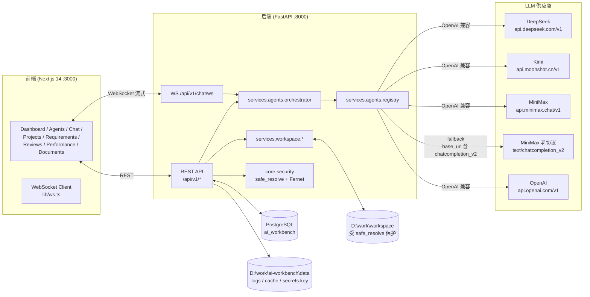
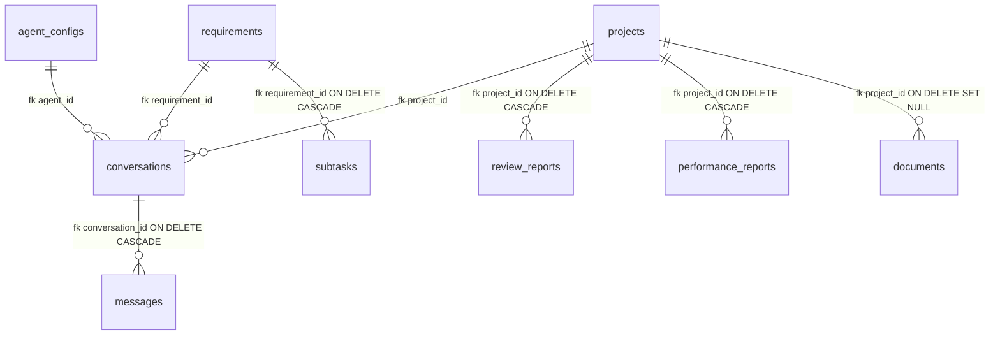

# 架构说明

## 设计目标

- **本地单用户**:所有 API Key、数据库、文件操作均限定在本机 (`127.0.0.1`)。
- **多模型兼容**:一套 UI/API 同时对接 DeepSeek / Kimi / MiniMax / OpenAI 兼容协议,加一个非 OpenAI 兼容的 MiniMax 老协议 fallback。
- **安全优先**:文件读写受沙箱保护,API Key Fernet 加密,日志脱敏,写操作必须二次确认。
- **全流程**:需求 → 聊天 → 代码审查 → 性能分析 → 文档生成 一站式完成。

## 顶层视图



## 模块划分

### 后端 (`backend/app/`)

| 层 | 模块 | 职责 |
|---|---|---|
| 入口 | `main.py` | FastAPI 实例 + CORS + 全局异常 + lifespan |
| 配置 | `config.py` | Pydantic Settings 读 `.env`,自动建 logs/exports/cache 子目录 |
| API | `api/router.py` + `api/v1/*` | 10 个路由聚合,统一前缀 `/api/v1` |
| 核心 | `core/security.py` | Fernet 加解密 + `safe_resolve()` 路径沙箱 |
| 核心 | `core/paths.py` | 忽略目录 / 敏感文件名 / Git 白名单 / 技术栈标记 |
| 核心 | `core/logger.py` | loguru 双输出 + ScrubFilter 脱敏 |
| DB | `db/session.py` + `db/base.py` + `db/models/*` | 异步引擎、基类、7 张 ORM 表 |
| Schema | `schemas/*` | Pydantic v2 输入输出模型 |
| Service | `services/agents/*` | 模型适配与调度 |
| Service | `services/workspace/*` | 文件 / Git / 审查 / 性能 |
| Service | `services/requirements.py` / `services/documents.py` | 需求 / 文档业务 |
| 提示词 | `prompts/*.md` | 5 份模板(chat / requirement / reviewer / performance / docs) |

### 前端 (`frontend/app/(main)/`)

| 路由 | 页面 | 说明 |
|---|---|---|
| `/` | Dashboard | Agents 数 / Projects 数 / Quick Chat / 流程引导 |
| `/agents` | Agents | 多供应商 CRUD + 联通测试 |
| `/chat` | Chat | WebSocket 流式对话 + 工具调用可视化 |
| `/projects` / `/projects/[id]` | Projects | 列表 + 详情(目录树 / 文件读写 / Git 面板) |
| `/requirements` / `/[id]` | Requirements | CRUD + 子任务 + 方案生成 + 拆解 |
| `/reviews` / `/[id]` | Reviews | 列表 + 详情(findings 展开) |
| `/performance` / `/[id]` | Performance | 列表 + 详情(静态规则 + AI 优化并列) |
| `/documents` / `/[id]` | Documents | 5 模板生成 + 润色 + 导出 |

### 共享层

- `frontend/lib/api.ts` — REST 封装
- `frontend/lib/store.ts` — Zustand 全局状态(`currentProjectId / currentConversationId / currentAgentId`)
- `frontend/lib/ws.ts` — `useChatSocket()` Hook,直接连 `ws://127.0.0.1:8000/api/v1/chat/ws`

## 数据流

### 1. 聊天流(典型链路)

```text
User → frontend chat page
   → ws.send({type:"start", agent_id, message, tools})
   → backend /api/v1/chat/ws
   → 创建 Conversation + Message(若新会话)
   → orchestrator.stream_chat(db, agent_id, messages)
       → decrypt(api_key) → registry.build_adapter(...) → adapter.stream_chat()
   → 每个 chunk → ws.send({type:"delta", content})
   → 检测 <tool:xxx args={...}> → 执行工具 → ws.send(tool_call/tool_result)
   → 二次调 LLM 给最终回复 → ws.send(delta ...)
   → 持久化 Message(assistant) → ws.send({type:"done", message_id})
```

### 2. 代码审查流

```text
User → POST /api/v1/reviews/run { project_id, agent_id, paths, categories }
   → services.workspace.reviewer.run_review()
       → _collect_files(): 扫描项目,跳过 lock/min/map,字符超限截断
       → 拼 REVIEW_PROMPT 模板(含 checklist) → stream_chat(agent)
       → _parse_findings(): 正则抓 ```json [...]``` → 校验字段
       → _summarize(): 统计 severity/category → 写库
   → 返回 ReviewOut
```

### 3. 文件写入流(二次确认)

```text
User → PUT /api/v1/projects/{id}/file { path, content, confirm:true, expected_original? }
   → safe_resolve(项目根 / path) → 校验必须 relative_to(项目根)
   → file_ops.write_text_file()
       → is_sensitive() 拦截 .env / *.key
       → expected_original 与磁盘内容不一致 → ValueError
       → 自动备份 .bak
       → 写盘
   → 返回 { path, written, abs_path }
```

## 安全模型

| 维度 | 实现 | 位置 |
|---|---|---|
| 路径沙箱 | `safe_resolve()` 禁 `..` + 必须 `relative_to(WORKSPACE_ROOT)` | `app/core/security.py` |
| 敏感文件 | `.env` / `*.pem` / `*.key` / `id_rsa*` 等 → `PermissionError` | `app/core/paths.py` |
| API Key | Fernet(AES-128 + HMAC),主密钥 `data/secrets.key`(`0o600`) | `app/core/security.py` |
| 写操作 | `confirm=True` + 可选 `expected_original` 一致性 + 自动 `.bak` | `app/services/workspace/file_ops.py` |
| 日志脱敏 | `api_key|token|secret|password=***` 替换 | `app/core/logger.py` |
| 启动信息 | 仅打印 `DATABASE_URL.split("@")[-1]`,密码段不出现 | `app/main.py` |
| CORS | 仅 `localhost:3000` / `127.0.0.1:*` | `app/config.py` |
| Git | GitPython 封装,无 `shell=True`,白名单子命令 | `app/core/paths.py` + `app/services/workspace/git_ops.py` |

## LLM 适配路由

```text
registry.build_adapter(provider, api_key, base_url, model)
   ↓
normalize_provider(provider) → "deepseek" | "kimi" | "openai" | "minimax"
   ↓
if p == "minimax" and "chatcompletion_v2" in base_url:
      → MiniMaxAdapter (老协议 fallback)
elif p in {deepseek, kimi, openai, minimax}:
      → OpenAICompatAdapter (默认, 流式 SSE)
else:
      → ValueError
```

`PROVIDER_ALIASES` 支持:`DeepSeek` / `深度求索` / `kimi` / `月之暗面` / `MiniMax` / `MiniMax` / `minimax-m2` / `abab6.5*` 等中文/旧写法。

## 数据模型(7 张表)



| 表 | 关键字段 |
|---|---|
| `agent_configs` | `provider / model / base_url / api_key_enc / system_prompt / extra / enabled` |
| `projects` | `name / path / tech_stack(JSON) / git_branch / git_dirty / last_modified` |
| `conversations` | `agent_id / project_id? / requirement_id? / meta(JSON) / title` |
| `messages` | `conversation_id / role[user/assistant/system/tool] / content / tokens_in/out / tool_calls(JSON)` |
| `requirements` | `status / priority[P0-P3] / project_ids(JSON) / solution_doc / tags` |
| `subtasks` | `requirement_id / project_id? / module / estimate_hours / status` |
| `review_reports` | `project_id / agent_id / scope / severity / findings(JSON) / rules(JSON)` |
| `performance_reports` | `project_id / agent_id / scope / findings(JSON) / static_findings(JSON)` |
| `documents` | `project_id? / title / type[README/API/ARCH/CHANGELOG/DEPLOY/OTHER] / content / tags / file_path?` |

## 关键设计决策

### 为什么 MiniMax 主走 OpenAI 兼容,而不是 chatcompletion_v2?

实测 MiniMax 官方 `/v1/chat/completions` 端点 100% 兼容 OpenAI 协议(`role=user + content=...`),免去维护双协议的成本。`chatcompletion_v2` 仅在用户配置的自建代理仍使用旧文档时作为 fallback 触发。

### 为什么用 WebSocket 而不是 SSE?

WebSocket 天然双向,便于"模型生成 → 工具调用 → 二次生成"的多回合编排;且 Next.js App Router 对 WS 没有原生支持,直接连 `127.0.0.1:8000` 比走 Next rewrite 更可靠。

### 为什么不用 Alembic?

W1 阶段表结构尚不稳定,`Base.metadata.create_all` 启动时建表更轻量;W3+ 引入 Alembic 做版本化迁移(目前 `scripts/init_db.py` 仍走 create_all)。

### 为什么不接 Web 搜索?

本地单用户场景 + 数据敏感性,所有 LLM 调用纯 API 直连,无第三方代理。
